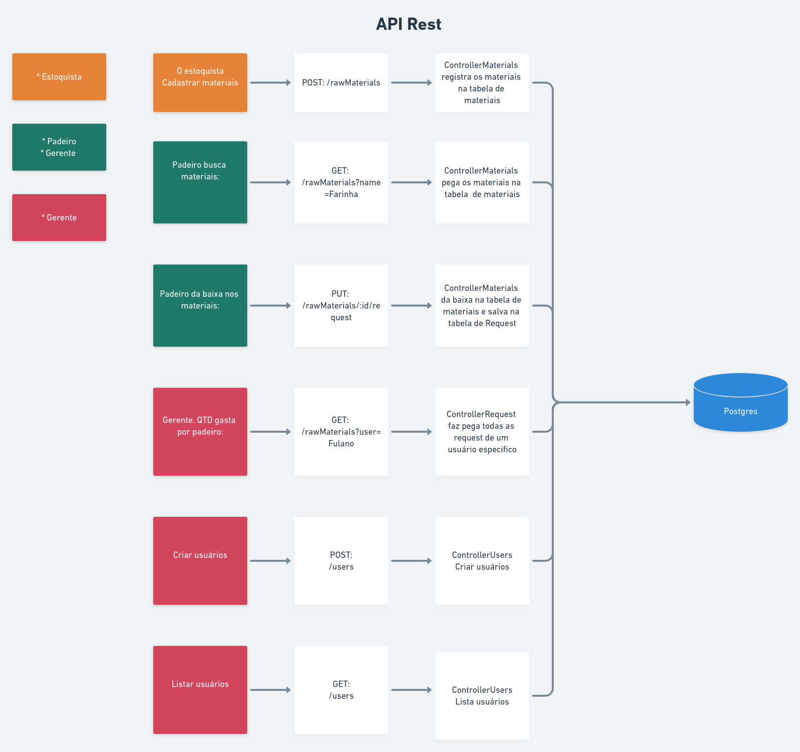

# 📦 Estoque-api

<p align="center" style="width: 200px;">
    
</p>

Uma api criada para gerenciar estoque de uma padaria

<div style="display: flex; flex-direction: row; " >


&nbsp;

&nbsp;

&nbsp;

&nbsp;

&nbsp;


</div>

<p align="center">
    
</p>

### 🎒 Pré-requisitos

- Node.js >= v12.16.3
- NPM
- Docker
- Git

# ▶ Como rodar

```
# Clone this repo
$ git clone https://github.com/Cristuker/estoque-api.git

# Acess folder
$ cd estoque-api

# To create a postgres container
$ docker container run --name materials -e POSTGRES_PASSWORD=materials123 -p 5432:5432 -d postgres

# Run api and database
$ npm run dev

# To create database
$ npx sequelize-cli db:create

# Run all migrations to create tables
$ npx sequelize-cli db:migrate
```

## 📦 Tecnologias

- Sequelize
- Express
- Eslint
- Eslint AirBnB Style
- Prettier
- Husky
- git-commit-msg-linter
- Yup
- JWT
- Bcrypt
- Nodemon
- Sucrase
- dotenv
- Swagger-ui-express
- yamljs

# 📔 Documentação

Essa API foi documentanda usando o Swagger

<a href="https://estoque-api-cris.herokuapp.com/api-docs/" target="_blank">Documentação</a>

#

> Esse projeto usa o padrão de [convetional commits](https://github.com/conventional-changelog/commitlint)

<p align="center">Made whit ❤️ by <strong><a href="http://linkedin.com/in/cristian-silva-dev" target="blank" >Cristian</></p></strong>
